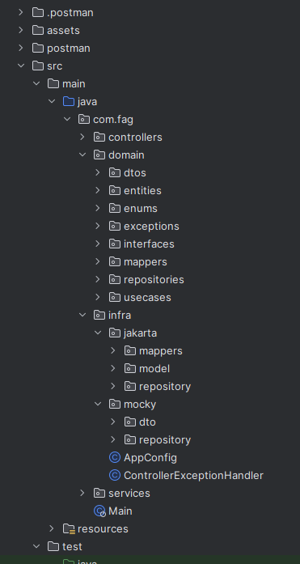

# Transaction API

_Leia isso em outros idiomas_:
[English](README.en-US.md)

## Visão Geral

Este projeto representa uma API de transações entre usuários, desenvolvida com base nos princípios da arquitetura limpa para garantir modularidade, flexibilidade e escalabilidade. Ao adotar essa abordagem, o código é organizado em camadas independentes, promovendo a separação de preocupações e facilitando a manutenção.

As tecnologias escolhidas para a implementação são:

- **Java**: A linguagem de programação robusta e versátil, escolhida pela sua ampla adoção na comunidade de desenvolvimento e pela sua capacidade de oferecer desempenho e confiabilidade.


- **Spring Boot**: Um framework que simplifica o desenvolvimento de aplicativos Java, fornecendo um conjunto abrangente de ferramentas e convenções para a criação rápida de serviços e APIs RESTful. O Spring Boot também integra facilmente com outras tecnologias e bibliotecas, acelerando o ciclo de desenvolvimento.


- **Jakarta Persistence API (JPA)**: Uma API padrão de persistência de dados para Java, que facilita a interação com bancos de dados relacionais. Ao adotar o JPA, o projeto ganha em portabilidade e flexibilidade, permitindo a troca de fornecedores de banco de dados de maneira mais transparente.


- **H2**: Um banco de dados em memória que oferece uma solução leve e eficiente para desenvolvimento e teste. A escolha do H2 agiliza o processo de desenvolvimento, permitindo que os desenvolvedores testem e validem a funcionalidade da API sem a necessidade de configurar um banco de dados mais robusto durante as fases iniciais do projeto.

## Funcionalidades Principais

### Criação de Transações:

- Permite aos usuários criar novas transações fornecendo detalhes como remetente, destinatário e valor.

### Listagem de Transações:

- Apresenta uma visão abrangente de todas as transações realizadas.
- Permite a filtragem por remetente, destinatário e outros critérios.

### Notificações em Tempo Real:

- Envia notificações automáticas para os usuários envolvidos em uma transação bem-sucedida através de um serviço externo.

### Autorização de Transações:

- Utiliza um serviço de autorização externo para validar transações antes da conclusão.

## Estrutura do Projeto



## Como Usar

### Java e Maven

Primeiramente, certifique-se de ter o [Java](https://www.oracle.com/java/technologies/downloads/) e o
[Maven](https://maven.apache.org/download.cgi) instalados.

### Instalar as dependências

- Spring Boot
- H2 Database
- Jakarta Persistence API

```
mvn clean install
```

### Banco de Dados

Configure as propriedades do banco de dados no arquivo `src/main/resources/application.properties`.

**Obs**: Por padrão, está configurado um banco de dados `H2` em memória.

### Postman

Nos diretórios do projeto, existe uma pasta chamada `postman`, contendo uma _collection_, com todos os endpoints da API.

Para utilizá-la, basta copiar o conteúdo do arquivo `postman/collections/Transaction API.json` e colar no _Postman_:


Caso utilize o [IntelliJ](https://www.jetbrains.com/idea/), é possível realizar as requisições HTTP pela IDE:


### Execute a aplicação:

Para iniciar a aplicação, utilize o comando:

```
mvn spring-boot:run
```

Por padrão, a aplicação irá inicializar na porta 8080.
